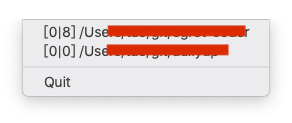

# Gitray

在系统状态栏添加一个图标, 用来显示所关注的 git 项目是否有未提交或者未推送的改动




---

## 使用方法

### 下载

编译

```sh
go build
```

### 添加 git 项目

```sh
# 假设你的有一个项目在 /Users/yourname/project/project1
cd /Users/yourname/project/project1
# 假设你 clone 的 gitray 目录在 /Users/yourname/project/gitray
pwd >> /Users/yourname/project/gitray/config.txt

# 假设你的还有一个项目在 /Users/yourname/project/project2
cd /Users/yourname/project/project1
pwd >> /Users/yourname/project/gitray/config.txt
```

### 运行

```sh
# macOS
./gitray &

```

PS: win 版本还没测过, 理论上是可用的 😛