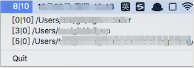

# Gitray

add an icon to systray, to indicate uncommited / unpushed changes of your git repositories



## Usage

### download

```sh
git clone https://github.com/ttchengcheng/gitray.git
```

### build

```sh
cd gitray
go build
```

### add git repositories

```sh
# a project at /Users/yourname/project/project1
cd /Users/yourname/project/project1
# and the cloned gitray is at /Users/yourname/project/gitray
pwd >> /Users/yourname/project/gitray/config.txt

# There is another project at /Users/yourname/project/project2
cd /Users/yourname/project/project1
pwd >> /Users/yourname/project/gitray/config.txt
```

### Run

```bash
./gitray &
```

### Some useful bash functions

add current directory to gitray

```bash
gw() {
  echo add $(pwd) to git watching list
  pwd >> ~/your_gitray_dir/config.txt
}
```

start or restart gittray

```bash
gtry() {
  echo 'kill running gitray'
  kill $(ps aux | grep '[g]itray' | awk '{print $2}') >/dev/null

  echo 'start gitray'
  ~/your_gitray_dir/gitray &
}
```

PS: it is not tested on win, maybe it works 😛